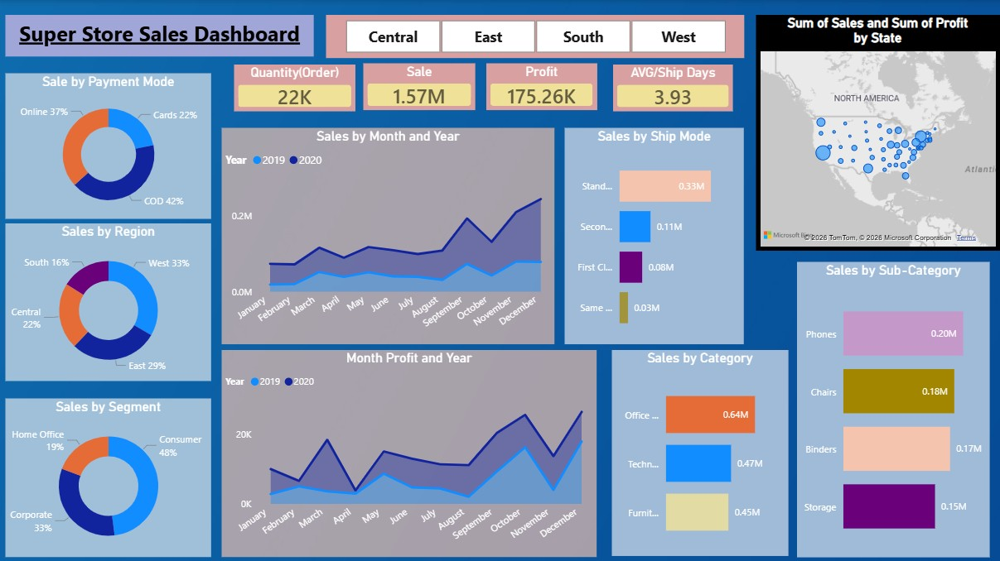
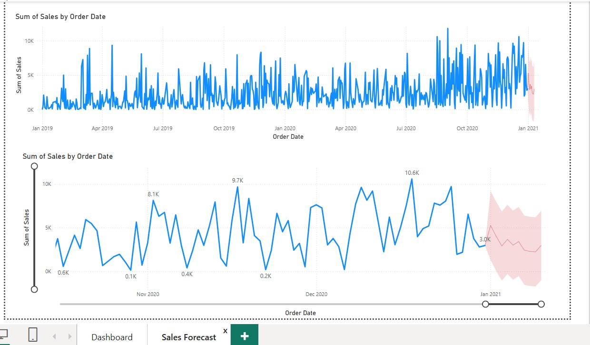

# Super Store Sales Dashboard | Power BI

## Project Overview
Developed an interactive Power BI dashboard to analyze sales performance, profitability, customer segments, shipping modes, and regional trends using Super Store sales data.

## Key Features
- KPI cards for Total Sales, Profit, Orders, and Average Shipping Days
- Sales analysis by Category and Sub-Category
- Regional and State-wise performance analysis
- Customer segment analysis
- Shipping and payment mode insights
- Monthly sales and profit trend analysis
- Interactive filters and drill-down capabilities

## Tools Used
- Power BI
- DAX
- Power Query
- Data Modeling
- Data Visualization

## Dashboard Preview

## Outcome
Provided actionable insights into top-performing regions, customer segments, and product categories to support business decision-making.
